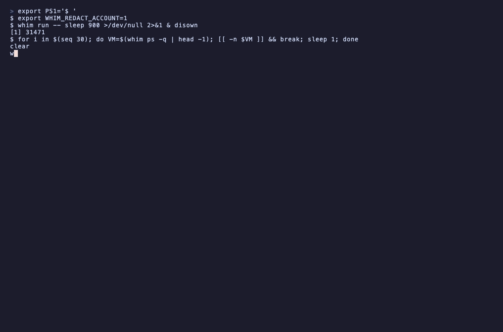

# whim

Ephemeral AWS Lambda MicroVM shells — a Go library (`microvm`) and CLI (`whim`).

Spin up a throwaway root shell in a Firecracker MicroVM in ~2 seconds, run
something, and let it disappear.



> Recorded against a real AWS account — the account ID is masked in-frame via
> `WHIM_REDACT_ACCOUNT`. `whim init` (cached), then the hero beat: an interactive
> root shell running `uname` / `os-release` / `whoami` at the `λ $` prompt, `Ctrl-]`
> to disconnect, and `image ls` / `ps` / `exec` / `gc` to list, reach into, and reap
> a live VM.

```
whim init            # one-time: build the default sandbox image (~3 min)
whim                 # drop into a throwaway root shell
whim run -- pytest   # spawn → run → stream output → propagate exit code → terminate
```

## How it works (build-once, run-many)

Lambda MicroVMs run from a **prebuilt image**, so there's a one-time bootstrap:

1. `whim init` provisions an S3 build bucket + IAM build role, then builds the
   default image (AL2023 + `tar`/`gzip`) and caches its ARN in
   `~/.config/whim/config.json`. This takes a couple of minutes.
2. After that, every `whim` / `whim run` launches a fresh VM from that cached
   image in ~2s, attaches over a WebSocket, and terminates on exit.

Every VM is launched with a **server-side TTL** (default 25m, max 8h) as a
cleanup backstop, so nothing is left running if a client dies.

## Requirements

- An AWS account enabled for Lambda MicroVMs, in a supported region (e.g. `us-east-1`)
- AWS credentials — `aws login`, `aws-vault`, an assumed role, or the environment
- Go 1.24+

## Install

```bash
go install github.com/udgover/whim/cmd/whim@latest   # → $(go env GOPATH)/bin
aws login
whim preflight-check      # verify creds + permissions
whim init                 # build the default image
```

For development, build from a clone instead:

```bash
git clone https://github.com/udgover/whim && cd whim
go install ./cmd/whim
```

## CLI

| Command | What it does |
|---|---|
| `whim` / `whim shell` | Launch a VM and attach an interactive root shell. **Ctrl-]** disconnects (every other key, incl. Ctrl-C, goes to the remote pty). |
| `whim run -- <cmd…>` | Launch → run → stream combined output → propagate the exit code → terminate. |
| `whim exec <id> -- <cmd…>` | Run a command in an existing VM. |
| `whim put <id> <local> <remote-dir>` / `whim get <id> <remote> <local-dir>` | Copy files/dirs in or out (tar.gz, binary-safe, `scp -r`/`docker cp` semantics). |
| `whim ps` [`-q`] [`--json`] | List your whim VMs — running/pending/suspended, state-labeled (like `docker ps`). |
| `whim gc` [`--older-than <dur>`] [`--yes`] | Terminate your whim VMs (confirms unless `--yes`). |
| `whim suspend <id>` / `whim resume <id>` | Pause/restart a VM (disk + memory preserved). |
| `whim image ls` [`-q`] [`--json`] / `whim image rm <name…>` | Manage built images. |
| `whim build <source> --name <n>` [`--egress public\|none`] [`--force`] [`--context-subdir <p>`] [`--json`] | Build a custom image from a local dir/Dockerfile, `s3://`/`https://` archive, or `github.com/org/repo@ref`; caches the ARN under `--name`. |
| `whim init` [`--image-name <n>`] [`--force`] / `whim preflight-check` / `whim version` | Bootstrap, checks, version. |

Global flags: `--region`, `--profile`. `shell`/`run` also take `--image <name|arn>`
and `--ttl <dur>`. `run`/`exec`/`put`/`get` exit **125** for whim-level failures
(distinct from a remote command's own code).

## Building custom images (`whim build`)

`whim init` builds the *default* image; `whim build` builds *custom* images from
your own source and caches each one by `--name` (the name is the build/reuse
key) alongside the default in `~/.config/whim/config.json`. It reuses the same
bootstrap (artifact bucket, build role, managed base image) as `init`.

```bash
whim build ./app          --name whim-app                       # local build context (Dockerfile at its root)
whim build ./Dockerfile   --name whim-min  --egress none        # a single local Dockerfile, airgapped image
whim build s3://my-bucket/app.zip            --name whim-s3 --json
whim build https://example.com/app.zip       --name whim-https
GITHUB_TOKEN=… whim build github.com/org/repo@<full-sha> --name whim-repo --force
```

Sources: a local directory or Dockerfile, an `s3://bucket/key`, an
`https://host/path` (zip archive or raw Dockerfile), or **GitHub shorthand**
`github.com/org/repo@ref` / `git+https://github.com/org/repo@ref`. GitHub
shorthand is CLI-only — it lowers to an HTTPS archive download (no `git` needed);
the `microvm` library transports are local, `s3://`, and `https://` only.

- **`--name` is required** and is the cache key: a second `whim build --name X`
  reuses the existing image `X` unless you pass `--force` (which deletes and
  rebuilds). Name-as-key means a changed source does **not** rebuild on its own.
- **`--egress public|none`** fixes the image's outbound policy at build time
  (inherited by every VM launched from it). `none` is airgapped.
- **`--context-subdir <p>`** descends into a subdirectory before locating the
  `Dockerfile` (also strips a single wrapping top-level dir from forge archives).
- **`--json`** prints one redacted object `{name, arn, source, cached, egress}`
  and suppresses progress chatter.
- **GitHub auth:** set `GITHUB_TOKEN` for private repos — it is sent only as a
  request header, never placed in a URL, printed, logged, or written to config.
  A full commit SHA ref is an immutable source identity; branches/tags are moving.

**Source safety & limits.** Every source — local, S3, and HTTPS alike — is
validated and normalized before any image build: archives are re-rooted, and
absolute/`..`/duplicate paths and root-escaping symlinks are rejected. Caps are
**256 MiB compressed, 1 GiB uncompressed, and 10,000 files**. A `.dockerignore`
at the context root is honored for a **documented subset**: blank lines, `#`
comments, `!` negation, leading-`/` anchoring, trailing-`/` directory matches,
and `*`/`?` single-segment globs. Unsupported constructs (`**` cross-segment
globs and `[…]` character classes) are **rejected** rather than mis-applied, so a
wrong ignore rule can't silently ship excluded files.

**Not in v0.1:** private-ECR base images (the build role's IAM is intentionally
not widened until that path is validated) — `whim build` builds on the managed
base image, same as `init`.

## Privileged shells (`--privileged`)

A whim shell is **root**, but under a restricted Linux capability set — so `mount`,
network namespaces, `unshare`, and eBPF are all denied (`EPERM`) even as uid 0.
`--privileged` grants the image AWS's `additionalOsCapabilities: ["ALL"]`, which
lifts the effective set to *all* capabilities. It is **opt-in**: default images
stay minimal-cap and privilege is never granted implicitly.

```bash
whim --privileged                 # throwaway shell that can mount, netns, run eBPF
whim run --privileged -- mount -t tmpfs none /mnt   # one-shot privileged command
```

`whim --privileged` launches the well-known **`whim-privileged`** image, building
it on first use (~2-3 min, like `whim init`) and caching its ARN alongside your
other images. It ships the tooling to *use* the caps — `util-linux` (mount,
`unshare`), `iproute` (`ip netns`), `e2fsprogs` — since capabilities unlock
syscalls, not binaries. `--privileged` and `--image` are mutually exclusive.

To bake privilege into a **custom** image instead, use `whim build --privileged`:

```bash
whim build ./app --name whim-app --privileged     # your source + ALL capabilities
```

Capabilities are fixed at **build time** and inherited by every VM launched from
the image. `ALL` is the only value AWS supports today. Elevated capabilities are
applied **within the VM's isolation boundary** — per AWS, they do not affect the
host or other MicroVMs.

## Library

The `microvm` package is the product; the CLI is a thin client. It is
**credential-injection-only** — it never resolves ambient credentials; you pass
an `aws.Config` you built (so it composes with IRSA, ECS task roles, aws-vault,
assumed roles, etc.).

```go
import "github.com/udgover/whim/microvm"

cfg, _ := config.LoadDefaultConfig(ctx)          // caller owns credential resolution
mgr := microvm.NewFromConfig(cfg)

sb, err := mgr.Launch(ctx, imageARN, microvm.WithTTL(25*time.Minute))
if err != nil { /* … */ }
defer sb.Terminate(ctx)

res, _ := sb.Exec(ctx, []string{"sh", "-c", "echo hi"})  // combined output + exit code
sb.Shell(ctx, microvm.ShellIO{In: os.Stdin, Out: os.Stdout})
sb.Put(ctx, "./src", "/opt"); sb.Get(ctx, "/var/log", "./logs")
sb.Suspend(ctx); sb.Resume(ctx)
mgr.List(ctx); mgr.GC(ctx, microvm.GCFilter{OlderThan: time.Hour})
```

To build a custom image from source, the library takes **explicit build
inputs** — there is no ambient discovery (the CLI owns that). The caller
supplies the artifact bucket, base image, and build role; GitHub shorthand and
default-bootstrap convenience live in the CLI, not here:

```go
arn, err := mgr.BuildFromSource(ctx, "./app", microvm.BuildFromSourceOptions{
    Name:           "whim-app",            // image name = reuse/cache key (required)
    ArtifactBucket: "my-artifact-bucket",  // caller-owned; staged context uploads here (required)
    BaseImageARN:   baseImageARN,          // managed/base image to build on (required)
    BuildRoleARN:   buildRoleARN,          // role the build assumes to read the staged artifact (required)
    Egress:         microvm.EgressNone,    // outbound policy, fixed at build time
    // Force, ContextSubdir, HTTPSHeaders, MaxCompressedBytes, MaxUncompressedBytes …
})
```

`source` resolves to exactly one transport — a local path, `s3://bucket/key`, or
`https://host/path`; `http://`, credential-bearing URL userinfo, and unknown
schemes are rejected.

Errors are typed sentinels (match with `errors.Is`): `ErrInvalidOption`,
`ErrInvalidSource`, `ErrSourceTooLarge`, `ErrImageNotFound`,
`ErrVMProvisionFailed`, `ErrImageBuildFailed`, `ErrConnClosed`, `ErrTimeout`,
`ErrTerminated`. For tests, inject a mock via `NewWithAPI`.

## Security model

The VM runs **your code as root**, reachable only through an authenticated
WebSocket. whim's guarantees:

- **Shell tokens are never logged** (the `X-aws-proxy-auth` value lives only in
  the request header).
- **Injection-only credentials** — `microvm` never sources ambient credentials.
- **Always a TTL** — no VM is launched without one (≤ 8h).
- **Privilege is opt-in** — default images run with a restricted capability set;
  `--privileged` (all OS capabilities) must be asked for explicitly, and its
  reach is confined to the VM's isolation boundary (host and other MicroVMs are
  unaffected).
- **Ownership-scoped cleanup** — `ps`/`gc` only ever touch VMs launched from
  **your own account's microvm-images**; AWS-managed base images and other
  accounts' VMs are never listed or reaped. (Microvms can't be tagged, so
  ownership is derived from the image ARN — see the caveat below.) `gc` confirms
  unless `--yes`.
- **Path-traversal & symlink guards** on `get` — a compromised VM cannot write
  outside the destination via a crafted tar (absolute/`..`/escaping-symlink
  entries are rejected; setuid/setgid bits are stripped).
- Remote paths are shell-quoted (no command injection via filenames).

**Ownership model:** only the *heuristic bulk* commands `ps`/`gc` are scoped to
whim-owned VMs. The **id-targeted** commands (`exec`, `put`, `get`, `suspend`,
`resume`) act on **any** VM in your account that you explicitly name — like
`ssh <host>`, naming the target is the authorization. In a shared account, an
explicit `whim suspend <foreign-id>` could affect someone else's workload.

## v0.1 limitations

- **Ownership is image-derived, not tagged.** Lambda MicroVMs can't be tagged, so
  `ps`/`gc` treat *any* VM launched from one of your account's microvm-images as
  whim-owned. In the rare case you run another tool that also launches from
  microvm-images, scope `gc` carefully.
- **Exec output is combined** stdout+stderr (a pty merges them); separate streams
  would need a guest agent.
- **Interactive shells last ~30 min** (the shell-token lifetime); `--ttl` above
  that doesn't extend the session (no reconnect in v0.1).
- **Transfers are in-memory**, capped at 256 MiB per `put`/`get`.
- **Reconnect yields a new shell** (disk persists, in-memory shell state does not).
- Terminal **resize isn't forwarded** yet (full-screen apps use the default size).

## Tests

Unit tests are hermetic (no AWS, no network):

```bash
go test ./...
```

Live AWS integration tests are build-tagged and opt-in — they provision and
build real images using your `whim init` artifact bucket and build role:

```bash
WHIM_INTEGRATION=1 go test -tags=integration ./...
```

The local-directory and `--egress none` builds run as-is; set
`WHIM_TEST_HTTPS_ZIP` (an `https://` zip whose Dockerfile is at the root) and
`WHIM_TEST_GITHUB=org/repo@<full-sha>` (plus `GITHUB_TOKEN` for private repos) to
exercise the remote-source paths. Override the derived inputs with
`WHIM_TEST_ARTIFACT_BUCKET` / `WHIM_TEST_BUILD_ROLE` / `WHIM_TEST_BASE_IMAGE`.

## License

Apache 2.0
